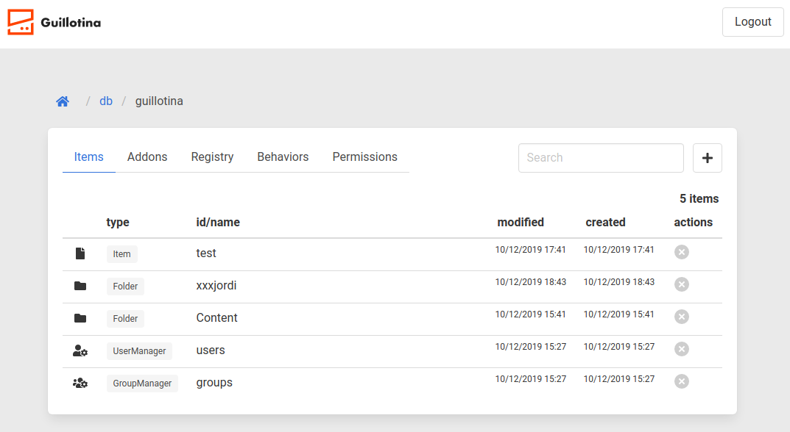
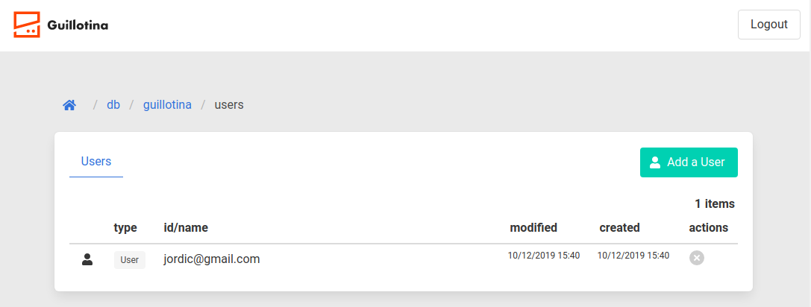
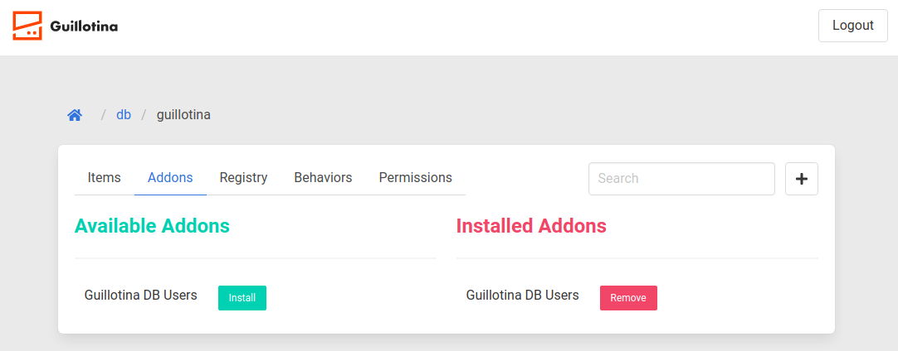

# 🔌 Guillotina Management Interface

It's build around the idea of a framework to roll you own GMI.

Provides an interface to access all Guillotina content depending on user permissions and allowing you to apply actions like create/modify/remove content, UI interactions like displaying flash messages, etc.

All this with the flexibility to build it your way, adding your own content with your forms, your icons, etc. It's build around the idea to act as a framework,
layer that could be extended from outside.

## Prerequisites

- React +16.12.0

## Status

Alpha version. The app is usable, but still needs some love.

## Roll your own guillotina

### With create react app

```bash

npx create-react-app gmi_demo
cd gmi_demo

yarn add @guillotinaweb/react-gmi

```

App.js

```jsx
import React from 'react'
import { Layout } from '@guillotinaweb/react-gmi'
import { Auth } from '@guillotinaweb/react-gmi'
import { Guillotina } from '@guillotinaweb/react-gmi'
import { Login } from '@guillotinaweb/react-gmi'
import { getClient } from '@guillotinaweb/react-gmi'
import { ClientProvider } from '@guillotinaweb/react-gmi'
import { useState } from 'react'
import '@guillotinaweb/react-gmi/dist/css/style.css'

// guillotina url
let url = 'http://localhost:8080'
const schema = '/'
const auth = new Auth(url)
const client = getClient(url, schema, auth)

function App() {
  const [isLogged, setLogged] = useState(auth.isLogged)

  const onLogin = () => {
    setLogged(true)
  }
  
  const onLogout = () => {
    setLogged(false);
  };

  auth.onLogout = onLogout

  return (
    <ClientProvider client={client}>
      <Layout auth={auth} onLogout={onLogout}>
        {isLogged && <Guillotina auth={auth} url={schema} />}
        {!isLogged && (
          <div className="columns is-centered">
            <div className="columns is-half">
               <Login
                onLogin={onLogin}
                auth={auth}
                currentSchema={schema}
              />
            </div>
          </div>
        )}
      </Layout>
    </ClientProvider>
  )
}


export default App
```

### To add icons:

Add the icons to the default public/index.html header

```diff
<meta name="viewport" content="width=device-width, initial-scale=1" />
+ <script defer src="https://use.fontawesome.com/releases/v5.3.1/js/all.js"></script>
<meta
      name="description"
      content="Web site created using create-react-app"
    />
```

- Copy guillotina logo to your public

```bash
curl https://raw.githubusercontent.com/guillotinaweb/guillotina_react/master/public/logo.svg > public/logo.svg

```

## Docs?

- [Howto Extend Guillotina React form outside?](docs/extend.md)
- [Narrative Docs](docs/api.md)
- [Getting Started - Step by Step](docs/tutorial/tutorial.md)

## Develop

```
run a local guillotina
yarn
yarn start

```

## Screenshots





## Sponsors

This project is sponsored by <a href="https://www.vinissimus.com">Vinissimus Wine Shop</a> and <a href="https://iskra.cat">Iskra</a>

<a href="https://www.vinissimus.com"></a>
<br/>
<a href="https://iskra.cat"></a>
