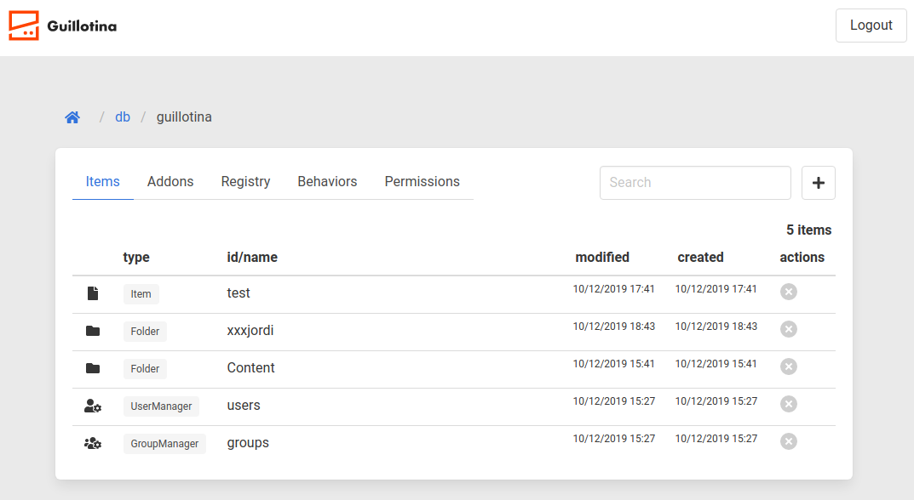
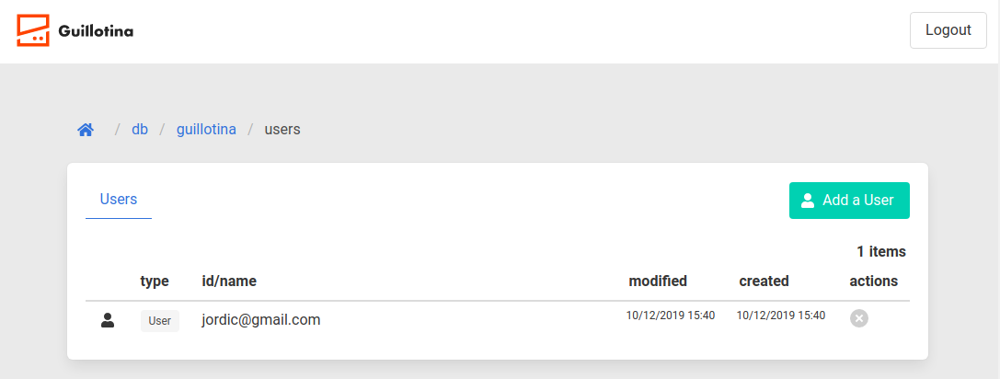
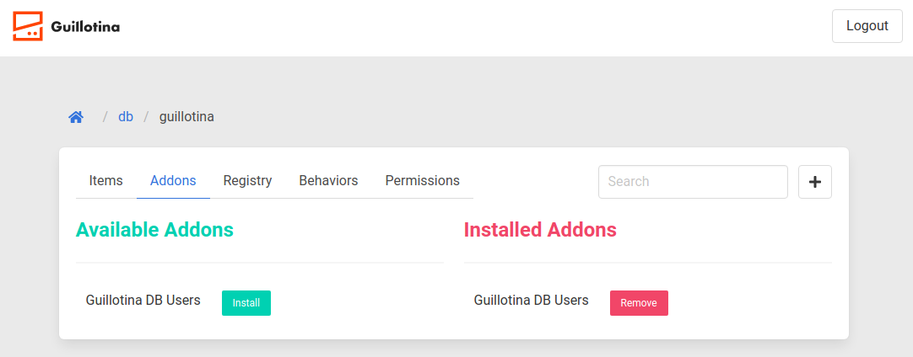

# 🔌 Guillotina Management Interface

A **framework-first React UI layer** for [Guillotina](https://guillotina.io/), enabling developers to build custom content management interfaces. It's built around the idea of a framework to roll your own GMI.

Provides an interface to access all Guillotina content depending on user permissions and allowing you to apply actions like create/modify/remove content, UI interactions like displaying flash messages, etc.

All this with the flexibility to build it your way, adding your own content with your forms, your icons, etc. It's built around the idea to act as a framework layer that could be extended from outside via the **registry pattern**.

## Prerequisites

- React 16.12+ / 17 / 18 / 19
- Node.js 20+
- TypeScript 5.4+

## Status

Stable version. Actively maintained and used in production.

## Quick Start

```bash
npm create vite@latest gmi_demo -- --template react-ts
cd gmi_demo
pnpm install
pnpm add @guillotinaweb/react-gmi
```

`App.tsx`

```tsx
import { useState, useEffect } from 'react'
import {
  Layout,
  Auth,
  Guillotina,
  Login,
  getClient,
  ClientProvider,
  GuillotinaClient,
} from '@guillotinaweb/react-gmi'
import '@guillotinaweb/react-gmi/css/style.css'

// Guillotina server URL
const url = 'http://localhost:8080'
const schemas = ['/db/container/']
const auth = new Auth(url)

function App() {
  const [currentSchema, setCurrentSchema] = useState('/db/container/')
  const [clientInstance, setClientInstance] = useState<
    GuillotinaClient | undefined
  >(undefined)
  const [isLogged, setLogged] = useState(auth.isLogged)

  useEffect(() => {
    setClientInstance(getClient(url, currentSchema, auth))
  }, [currentSchema])

  const onLogin = () => {
    setLogged(true)
  }

  const onLogout = () => {
    setLogged(false)
  }

  if (clientInstance === undefined) {
    return null
  }

  return (
    <ClientProvider client={clientInstance}>
      <Layout auth={auth} onLogout={onLogout}>
        {isLogged && (
          <Guillotina
            auth={auth}
            url={currentSchema}
            locale="en"
            registry={{}}
          />
        )}
        {!isLogged && (
          <div className="columns is-centered">
            <div className="column is-half">
              <Login
                onLogin={onLogin}
                auth={auth}
                schemas={schemas}
                currentSchema={currentSchema}
                setCurrentSchema={setCurrentSchema}
              />
            </div>
          </div>
        )}
      </Layout>
    </ClientProvider>
  )
}

export default App
```

### Adding Icons

Add Font Awesome icons to your HTML:

```html
<script defer src="https://use.fontawesome.com/releases/v5.3.1/js/all.js"></script>
```

### Extending with Registry Pattern

The framework uses a registry system that allows you to override views, forms, actions, and behaviors:

```tsx
<Guillotina
  auth={auth}
  url={schema}
  registry={{
    views: {
      MyCustomType: MyCustomView,
    },
    forms: {
      MyCustomType: MyCustomForm,
    },
    actions: {
      myAction: MyActionModal,
    },
    behaviors: {
      'my.behavior.Interface': MyBehaviorPanel,
    },
  }}
/>
```

See the [Extension Guide](docs/extend.md) for detailed examples.

## Documentation

- [Getting Started - Step by Step](docs/tutorial/tutorial.md) - Complete tutorial
- [Development Setup](docs/development-setup.md) - Set up your local environment
- [Extension Guide](docs/extend.md) - How to extend and customize
- [API Documentation](docs/api.md) - Component and hook reference

## Development

### Prerequisites

- Node.js 20+
- pnpm 9+ (`npm install -g pnpm`)
- Docker (for running Guillotina)

### Quick Start

```bash
# Clone and install
git clone git@github.com:guillotinaweb/guillotina_react.git
cd guillotina_react
pnpm install

# Start Guillotina backend (see docs/development-setup.md for details)
docker run -d --name postgres -e POSTGRES_DB=guillotina -e POSTGRES_USER=guillotina -e POSTGRES_HOST_AUTH_METHOD=trust -p 5432:5432 postgres:18
docker run --rm -it --link=postgres -p 8080:8080 plone/guillotina:latest

# Start development server
pnpm dev
```

### Available Scripts

| Command | Description |
|---------|-------------|
| `pnpm dev` | Start playground with HMR (Vite) |
| `pnpm build` | Build the library (JS + CSS) using Vite |
| `pnpm test` | Run unit tests (Vitest) |
| `pnpm test:e2e` | Run E2E tests (Playwright) |
| `pnpm lint` | Run ESLint |
| `pnpm format` | Format with Prettier |

## Screenshots





## Sponsors

This project is sponsored by <a href="https://iskra.cat">Iskra</a>

<a href="https://iskra.cat"></a>

