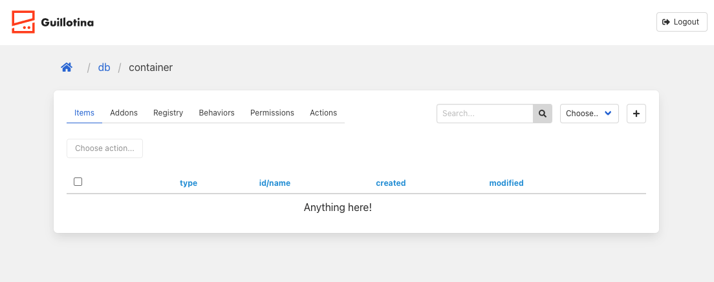

## 3. Firsts steps with GMI UI

### Login as root  

Go to http://locahost:3000 and do login with root credentials:

```
username: root
password: root
```

### Create first container

After login you are in the data base view.
In this view, there is a list of all contaniers where you can create a new contanier. 
Do click in `db` and then create the first container called `container`. Then go to `container` view.

### Container view



We can see some tabs, this is the default view for content type `Container`. 


- Items: List of items.
- Addons: In this tab you can install or uninstall guillotina addons in container.
- Registry: This tab is not implemented but the idea is to get guillotina registry info. 
- Behaviors: Here you can get object's behaviors and add or delete them.
- Permissions: Manage object's permissions.
- Actions: Delete, copy and move objects.

### Traversal


Through the traversal context we have access to the Guillotina content and to some UI actions / helpers.
We defined this in `path` query param. For example, container view woulde be:

`http://localhost:3000?path=/db/container`


[Previous step](step-2-create-gmi-app.md)

[Next step](step-4-our-firsts-objects.md)
