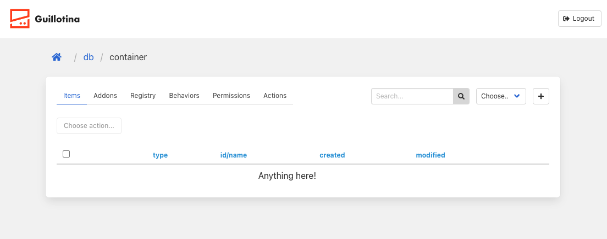

## 3. First steps with GMI UI

### Log in as root

Go to `http://127.0.0.1:5173` and log in with root credentials:

```
username: root
password: root
```

### Create first container

After logging in, you are in the database view.
In this view, there is a list of all containers where you can create a new container. 
Click on `db` and then create the first container called `container`. Then go to the `container` view.

### Container view



We can see some tabs, this is the default view for content type `Container`. 


- Items: List of items.
- Addons: In this tab you can install or uninstall guillotina addons in container.
- Registry: This tab is not implemented but the idea is to get guillotina registry info. 
- Behaviors: Here you can get object's behaviors and add or delete them.
- Permissions: Manage object's permissions.
- Actions: Delete, copy and move objects.

### Traversal


Through the traversal context, we have access to the Guillotina content and to some UI actions and helpers.
We define this in the `path` query parameter. For example, the container view would be:

`http://127.0.0.1:5173?path=/db/container`


[Previous step](step-2-create-gmi-app.md)

[Next step](step-4-our-firsts-objects.md)
