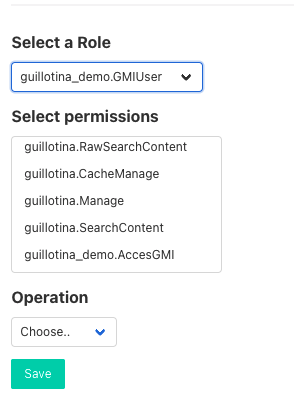

## 6. Configure main app to login in root or in any container.

### Configure differents schemas

Modify App.js to can be able to choose diferents schemas when do login

```jsx

// same imports

// guillotina url
let url = "http://127.0.0.1:8080";
const schemas = ["/", "/db/container/"];
const auth = new Auth(url);

function App() {
  const [currentSchema, setCurrentSchema] = useState(
    localStorage.getItem("currentSchema") ?? "/"
  );
  const [clientInstance, setClientInstance] = useState(undefined);
  const [isLogged, setLogged] = useState(auth.isLogged);

  useEffect(() => {
    setClientInstance(getClient(url, currentSchema, auth));
  }, [currentSchema]);

  const onLogin = () => {
    localStorage.setItem("currentSchema", currentSchema);
    setLogged(true);
  };

  const onLogout = () => {
    localStorage.removeItem("currentSchema");
    setCurrentSchema("/");
    setLogged(false);
  };

  if (clientInstance === undefined) {
    return null;
  }

  return (
    <ClientProvider client={clientInstance}>
      <Layout auth={auth} onLogout={onLogout}>
        {isLogged && <Guillotina auth={auth} url={currentSchema} />}
        {!isLogged && (
          <div className="columns is-centered">
            <div className="columns is-half">s
              <Login
                onLogin={onLogin}
                auth={auth}
                schemas={schemas}
                currentSchema={currentSchema}
                setCurrentSchema={setCurrentSchema}
              />
            </div>
          </div>
        )}
      </Layout>
    </ClientProvider>
  );
}

export default App;
```

We can choose in which place will do login. Root user can do login in both places but new user can only do login in new container.
After logging in with new user, you can not acces to container. To give acces content and view content permission, do login with root user and go to container permission tab.


### Users permissions

Go to permissions tab

In right section, choose `Principal Roles` option, then select principal, in this case our user. Then selected guillotina.Reader and guillotina.Member roles and finally `Allow` operation.

If you want, you could add user in to group and do the same with the group. 

> More info about permissions in <a href="https://guillotina.readthedocs.io/en/latest/developer/security.html"> guillotina docs. </a>

Retry to do login with user. Now you can see container. 

### Create new permission to acces in GMI. 

Now we will create a new permission to allow/deny users to login. Create new file `guillotina_demo/guillotina_demo/permissions.py`

```py
from guillotina import configure

configure.permission("guillotina_demo.AccesGMI", "Acces to GMI")

configure.role("guillotina_demo.GMIUser", "GMIUser", "Have acces to GMI", True)

configure.grant(permission="guillotina_demo.AccesGMI", role="guillotina_demo.GMIUser")
```

Then modify `guillotina_demo/guillotina_demo/__init__.py`

```diff
from guillotina import configure


app_settings = {
    # provide custom application settings here...
}


def includeme(root):
    """
    custom application initialization here
    """
    configure.scan('guillotina_demo.api')
    configure.scan('guillotina_demo.install')
+    configure.scan('guillotina_demo.permissions')

```

Now we will modify login function in GMI

Create `gmi_demo/src/lib/auth.js`

```js
import { Auth } from "@guillotinaweb/react-gmi";

export class CustomAuth extends Auth {
  async login(username, password) {
    const url = this.getUrl("@login");
    const canido_url = this.getUrl(
      "@canido?permissions=guillotina_demo.AccesGMI"
    );
    try {
      const responseLogin = await fetch(url, {
        method: "post",
        body: JSON.stringify({
          username: username,
          password: password,
        }),
      });
      if (responseLogin.status !== 200) {
        this.errors = "invalid_credentials";
        return false;
      }

      const responseLoginData = await responseLogin.json();

      const respCanIdo = await fetch(canido_url, {
        headers: {
          Accept: "application/json",
          Authorization: `Bearer ${responseLoginData.token}`,
        },
      });

      if (respCanIdo.status !== 200 && username !== "root") {
        this.errors = "invalid_credentials";
        return false;
      }

      const canIdoData = await respCanIdo.json();

      if (
        (!("guillotina_demo.AccesGMI" in canIdoData) ||
          !canIdoData["guillotina_demo.AccesGMI"]) &&
        username !== "root"
      ) {
        this.errors = "invalid_credentials";
        return false;
      }

      this.storeAuth(responseLoginData, username);
      return true;
    } catch (e) {
      this.errors = "failed_to_fetch";
      return false;
    }
  }
}

```

Finally update `gmi_demo/src/App.js` to use customAuth class


```diff

- import { Auth } from "@guillotinaweb/react-gmi";
+import { CustomAuth } from "./lib/auth"; 

...

- const auth = new Auth(url);
+ const auth = new CustomAuth(url);

...

```

At this point, you can only do login with `root` user, you need to add the users that you want to have acces to GMI in Permission tab in container view.

The role and permission than you have created, now they appear in selects. 




[Previous step](step-5-manage-users.md)

[Next step](step-7-create-own-content-type.md)