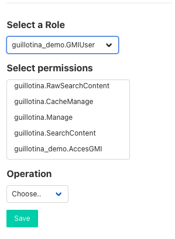

## 6. Configure main app to log in to root or any container

### Configure different schemas

Modify `App.tsx` to be able to choose different schemas when logging in:

```tsx
import { useState, useEffect } from 'react'
import {
  Layout,
  Auth,
  Guillotina,
  Login,
  getClient,
  ClientProvider,
} from '@guillotinaweb/react-gmi'

// Guillotina server URL
const url = 'http://127.0.0.1:8080'
const schemas = ['/', '/db/container/']
const auth = new Auth(url)

function App() {
  const [currentSchema, setCurrentSchema] = useState(
    localStorage.getItem('currentSchema') ?? '/'
  )
  const [clientInstance, setClientInstance] = useState<
    ReturnType<typeof getClient> | undefined
  >(undefined)
  const [isLogged, setLogged] = useState(auth.isLogged)

  useEffect(() => {
    setClientInstance(getClient(url, currentSchema, auth))
  }, [currentSchema])

  const onLogin = () => {
    localStorage.setItem('currentSchema', currentSchema)
    setLogged(true)
  }

  const onLogout = () => {
    localStorage.removeItem('currentSchema')
    setCurrentSchema('/')
    setLogged(false)
  }

  if (clientInstance === undefined) {
    return null
  }

  return (
    <ClientProvider client={clientInstance}>
      <Layout auth={auth} onLogout={onLogout}>
        {isLogged && <Guillotina auth={auth} url={currentSchema} />}
        {!isLogged && (
          <div className="columns is-centered">
            <div className="columns is-half">
              <Login
                onLogin={onLogin}
                auth={auth}
                schemas={schemas}
                currentSchema={currentSchema}
                setCurrentSchema={setCurrentSchema}
              />
            </div>
          </div>
        )}
      </Layout>
    </ClientProvider>
  )
}

export default App
```

We can choose in which places we will log in. The root user can log in to both places, but a new user can only log in to the new container.
After logging in as the new user, you cannot access the container. To grant access to content and view content permissions, log in as the root user and go to the container permissions tab.


### User permissions

Go to permissions tab.

In the right section, choose the `Principal Roles` option, then select a principal (in this case, our user). Then select the guillotina.Reader and guillotina.Member roles and finally click the `Allow` operation.

If you want, you could add the user to a group and perform the same action with it. 

> More info about permissions in <a href="https://guillotina.readthedocs.io/en/latest/developer/security.html"> guillotina docs. </a>

Try logging in as the new user again. Now you can see the container. 

### Create new permission to access GMI 

Now we will create a new permission to allow/deny users to login. Create new file `guillotina_demo/guillotina_demo/permissions.py`

```py
from guillotina import configure

configure.permission("guillotina_demo.AccesGMI", "Access to GMI")

configure.role("guillotina_demo.GMIUser", "GMIUser", "Have access to GMI", True)

configure.grant(permission="guillotina_demo.AccesGMI", role="guillotina_demo.GMIUser")
```

Then modify `guillotina_demo/guillotina_demo/__init__.py`

```diff
from guillotina import configure


app_settings = {
    # provide custom application settings here...
}


def includeme(root):
    """
    custom application initialization here
    """
    configure.scan('guillotina_demo.api')
    configure.scan('guillotina_demo.install')
+    configure.scan('guillotina_demo.permissions')

```

Now we will modify the login function in GMI

Create `gmi_demo/src/lib/auth.ts`:

```ts
import { Auth } from '@guillotinaweb/react-gmi'

export class CustomAuth extends Auth {
  async login(username, password) {
    const url = this.getUrl("@login");
    const canido_url = this.getUrl(
      "@canido?permissions=guillotina_demo.AccesGMI"
    );
    try {
      const responseLogin = await fetch(url, {
        method: "post",
        body: JSON.stringify({
          username: username,
          password: password,
        }),
      });
      if (responseLogin.status !== 200) {
        this.errors = "invalid_credentials";
        return false;
      }

      const responseLoginData = await responseLogin.json();

      const respCanIdo = await fetch(canido_url, {
        headers: {
          Accept: "application/json",
          Authorization: `Bearer ${responseLoginData.token}`,
        },
      });

      if (respCanIdo.status !== 200 && username !== "root") {
        this.errors = "invalid_credentials";
        return false;
      }

      const canIdoData = await respCanIdo.json();

      if (
        (!("guillotina_demo.AccesGMI" in canIdoData) ||
          !canIdoData["guillotina_demo.AccesGMI"]) &&
        username !== "root"
      ) {
        this.errors = "invalid_credentials";
        return false;
      }

      this.storeAuth(responseLoginData, username);
      return true;
    } catch (e) {
      this.errors = "failed_to_fetch";
      return false;
    }
  }
}

```

Finally update `gmi_demo/src/App.tsx` to use CustomAuth class


```diff

- import { Auth } from "@guillotinaweb/react-gmi";
+import { CustomAuth } from "./lib/auth"; 

...

- const auth = new Auth(url);
+ const auth = new CustomAuth(url);

...

```

At this point, you can only log in as the `root` user. You need to add the users that you want to have access to GMI in the Permissions tab in the container view.

The role and permission that you have created should appear in the selects. 




[Previous step](step-5-manage-users.md)

[Next step](step-7-create-own-content-type.md)