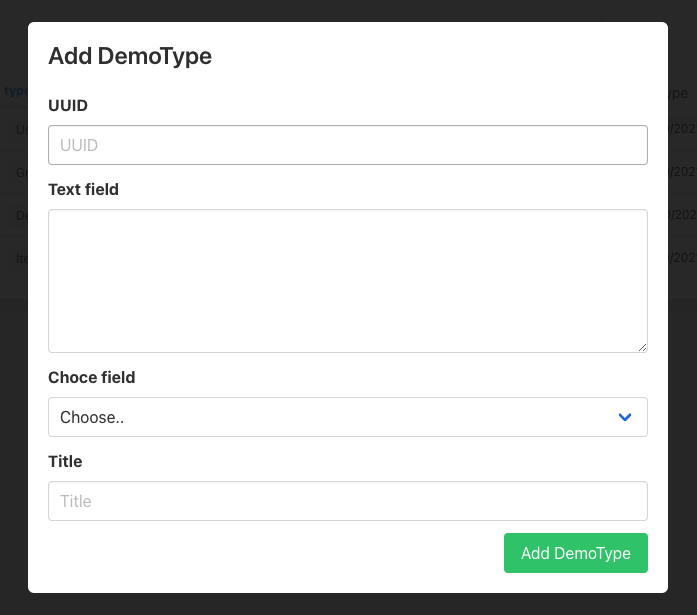

## 7. Create own content type

Create a `guillotina_demo/guillotina_demo/content.py` file and create the content type.


```py
from guillotina import schema
from guillotina import configure
from guillotina.content import Folder
from guillotina.interfaces import IFolder
from guillotina.directives import index_field


class IDemoType(IFolder):

    index_field("text_field", type="searchabletext")
    text_field = schema.Text(
        title="Text field",
        required=True
    )

    index_field("text_richtext_field", type="searchabletext")
    text_richtext_field = schema.Text(
        title="Rich text field",
        widget= "richtext",
        required=False
    )

    index_field("number_field", type="int")
    number_field = schema.Int(
        title="Number field",
        required=False
    )

    index_field("choice_field", type="keyword")
    choice_field = schema.Choice(
        title="Choce field",
        values=("plone", "guillotina", "other"),
        required=True,
    )
    
    index_field("boolean_field", type="boolean")
    boolean_field = schema.Bool(
        title="Boolean field",
        required=False,
        default=False,
    )

    index_field("list_field", type="keyword")
    list_field = schema.List(
        value_type=schema.TextLine(title="Item list field"),
        required=False,
        missing_value=[],
        title="List field",
    )

    date_time_field = schema.Datetime(
        required=False,
        title="Date time field",
    )

    date_field = schema.Date(
        required=False,
        title="Date field",
    )


@configure.contenttype(
    type_name="DemoType",
    schema=IDemoType,
    behaviors=[
        'guillotina.behaviors.dublincore.IDublinCore',
        'guillotina.behaviors.attachment.IMultiAttachment'
    ]
)
class DemoType(Folder):
    pass


```

In order for Guillotina to detect your configuration, you will need to add a scan call inside your includeme function in the __init__.py file.

```diff

... 

def includeme(root):
    """
    custom application initialization here
    """
    configure.scan('guillotina_demo.api')
    configure.scan('guillotina_demo.install')
    configure.scan('guillotina_demo.permissions')
+   configure.scan('guillotina_demo.content')

```

Now you can add a Demo type object. Click on plus icon in container view and try to add it. You will see that you can't, this is because we are not sending all the required fields. To solve this we will override the default form. 

### Define custom form

Modify `gmi_demo/App.js`

```diff

...
+ import { RequiredFieldsForm } from "@guillotinaweb/react-gmi";
...

const auth = new CustomAuth(url);

+ const registry = {
+   forms: {
+     DemoType: RequiredFieldsForm,
+   },
+ };

function App() {

...

{isLogged && (
-  <Guillotina auth={auth} url={currentSchema} />
+  <Guillotina auth={auth} url={currentSchema} registry={registry} />
)}

...

```

Here we have defined the registry. In registry we can override diferent components by each content type. More information in - [Narrative Docs](../api.md)

After this, we can create a new DemoType object doing the same process. Now, we can see all the requried files. 

Add it!





[Previous step](step-6-configure-main-app-login.md)

[Next step](step-8-content-type-view.md)
