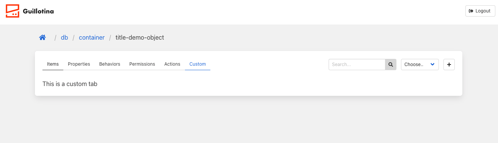
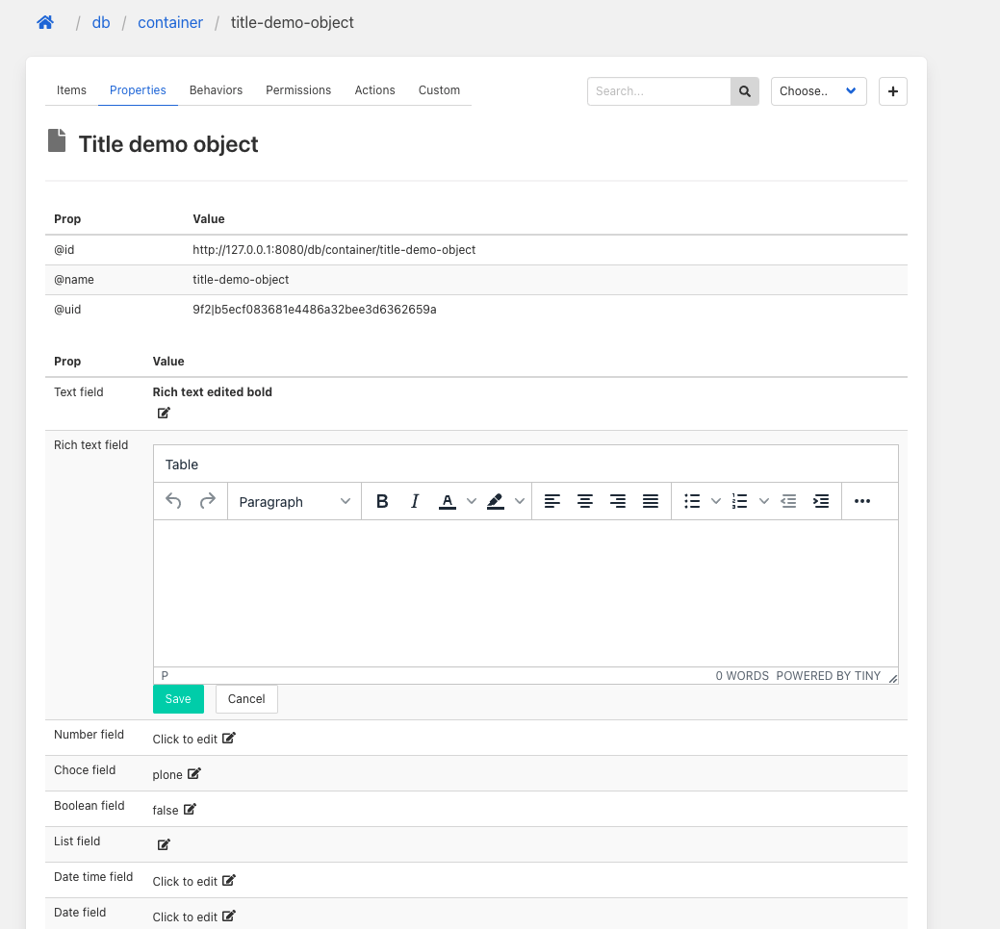

## 8. Content type view

Go to demoType object view, you can see the same as the folder type. Let's modify it.

Create `gmi_demo/src/views/demoType.js`

```jsx
  import React from "react";
  import {
    TabsPanel,
    ContextToolbar,
    PanelItems,
    PanelActions,
    useTraversal,
    PanelProperties,
    PanelPermissions,
    PanelBehaviors,
  } from "@guillotinaweb/react-gmi";

  const tabs = {
    Items: PanelItems,
    Properties: PanelProperties,
    Behaviors: PanelBehaviors,
    Permissions: PanelPermissions,
    Actions: PanelActions,
  };

  const tabsPermissions = {
    Items: "guillotina.ViewContent",
    Properties: "guillotina.ViewContent",
    Behaviors: "guillotina.ModifyContent",
    Permissions: "guillotina.SeePermissions",
  };

  export function DemoTypeView(props) {
    const ctx = useTraversal();
    const calculated = ctx.filterTabs(tabs, tabsPermissions);

    return (
      <TabsPanel
        tabs={calculated}
        currentTab="Items"
        rightToolbar={<ContextToolbar {...props} />}
        {...props}
      />
    );
  }

```

Now we will define which view we want in DemoType object. Modify `App.js`

```diff

... 

+ import { DemoTypeView } from "./views/demoType";

...

const registry = {
+  views: {
+    DemoType: DemoTypeView,
+  },
  forms: {
    DemoType: RequiredFieldsForm,
  },
};

...

```

 You can add more tabs in our custom view.

`demoType.js`

```diff

...

const tabs = {
  Items: PanelItems,
  Properties: PanelProperties,
  Behaviors: PanelBehaviors,
  Permissions: PanelPermissions,
  Actions: PanelActions,
+  Custom: () => <div> This is a custom tab </div>,
};

const tabsPermissions = {
  Items: "guillotina.ViewContent",
  Properties: "guillotina.ViewContent",
  Behaviors: "guillotina.ModifyContent",
  Permissions: "guillotina.SeePermissions",
+  Custom: "guillotina.ViewContent",
};

...

```



### Modify list columns

We have our custom view of new custom content type. Now let's modify list columns. 

Create `gmi_dmeo/src/columns/demoType.js`

```jsx
import React from "react";
import { Icon, TdLink } from "@guillotinaweb/react-gmi";

export const ColumnsDemoType = () => {
  const smallcss = { width: 25 };
  const mediumcss = { width: 120 };

  return [
    {
      label: "",
      child: (m) => <td style={smallcss}>{<Icon icon={m.icon} />}</td>,
    },
    {
      label: "type",
      child: (m) => (
        <TdLink style={smallcss} model={m}>
          <span className="tag">{m.type}</span>
        </TdLink>
      ),
    },
    {
      label: "id/name",
      child: (m, navigate, search) => (
        <TdLink model={m}>
          {m.name}
          {search && (
            <React.Fragment>
              <br />
              <span className="is-size-7 tag is-light">{m.path}</span>
            </React.Fragment>
          )}
        </TdLink>
      ),
    },
    {
      label: "path",
      child: (m) => (
        <td style={mediumcss} className="is-size-7 is-vcentered">
          {m.item.path}
        </td>
      ),
    },
    {
      label: "created",
      child: (m) => (
        <td style={mediumcss} className="is-size-7 is-vcentered">
          {m.created}
        </td>
      ),
    },
    {
      label: "modified",
      child: (m) => (
        <td style={mediumcss} className="is-size-7 is-vcentered">
          {m.updated}
        </td>
      ),
    },
  ];
};

```

Here we have added the path column.


Open again `App.js`:


```diff

... 

+ import { ColumnsDemoType } from "./columns/demoType";

...

const registry = {
  views: {
    DemoType: DemoTypeView,
  },
  forms: {
    DemoType: RequiredFieldsForm,
  },
+  itemsColumn: {
+    DemoType: ColumnsDemoType,
+  },
};

...

```

### Properties fields

Guillotina exposes a json schema of each content type. In GMI we use this schema to auto generate all fields. The handler to get schema information and create the appropiate fields is `EditableField` component. In `EditableField` there are two main components, `EditComponent` and `RenderFieldComponent` both of them can be overrided. 

`EditComponent` returns input component according to the schema information. For example, if the type is `number` it returns a number input type.
`RenderFieldComponent` renders field value depending on the type ( or other property ). If you want to render the formatted value you can overided it. 

Demo content type has a rich text field, this property is a `Text` but we have defined a widget called `richtext`. By default, GMI renders `Text` type in textarea. Let's modify it to render another component. 

## Edit component

Create `gmi_demo/src/components/EditComponent.js`, this is the default EditComponent. You can see when widget is textarea or richtext, we render `Textarea` component. 

```jsx
import React from "react";
import {
  Textarea,
  Checkbox,
  FileUpload,
  Select,
  Input,
  InputList,
  get,
} from "@guillotinaweb/react-gmi";

export const EditComponent = React.forwardRef(
  ({ schema, val, setValue, dataTest, className, ...rest }, ref) => {
    if (schema?.widget === 'textarea' || schema?.widget === 'richtext') {
      return (
        <Textarea
          value={val || ''}
          className={className}
          onChange={(ev) => setValue(ev)}
          ref={ref}
          dataTest={dataTest}
          {...rest}
        />
      )
    } else if (schema?.type === 'boolean') {
      return (
        <Checkbox
          value={!!val}
          className={className}
          onChange={(ev) => setValue(ev)}
          ref={ref}
          dataTest={dataTest}
          {...rest}
        />
      )
    } else if (schema?.type === 'array') {
      return (
        <InputList
          value={val || []}
          className={className}
          onChange={(ev) => setValue(ev)}
          ref={ref}
          dataTest={dataTest}
          {...rest}
        />
      )
    } else if (schema?.widget === 'file') {
      return (
        <FileUpload
          onChange={(ev) => setValue(ev)}
          label={get(val, 'filename', null)}
          dataTest={dataTest}
          {...rest}
        />
      )
    } else if (schema?.widget === 'select') {
      return (
        <Select
          value={val || ''}
          className={className}
          appendDefault
          classWrap="is-fullwidth"
          dataTest={dataTest}
          {...rest}
          options={schema?.vocabulary.map((item) => {
            return {
              text: item,
              value: item,
            }
          })}
          onChange={(ev) => {
            const selectValue = get(ev, 'target.value', '')
            return setValue(selectValue)
          }}
        />
      )
    }
    const getInputType = () => {
      switch (schema?.type) {
        case 'integer':
          return 'number'
        case 'date':
          return 'date'
        case 'datetime':
          return 'datetime-local'
        default:
          return 'text'
      }
    }
    return (
      <Input
        value={val || ''}
        className={className}
        dataTest={dataTest}
        onChange={(ev) => setValue(ev)}
        ref={ref}
        type={getInputType()}
        {...rest}
      />
    )
  }
)

EditComponent.displayName = 'EditComponent'
export default EditComponent
```


Install tinymce:

```
npm install --save @tinymce/tinymce-react
```

Create rich text edit component `src/components/RichText.js`

```jsx
import { Editor } from "@tinymce/tinymce-react";
import { Fragment, useState } from "react";

export const RichText = ({ val, setValue, id, placeholder }) => {
  const [loading, setLoading] = useState(true);
  return (
    <Fragment>
      {loading && <div className="p-4">Loading...</div>}
      <label className="label" htmlFor={id}>
        {placeholder}
      </label>
      <Editor
        apiKey="9ubkcjelsw09eia53jdpmu2re0lz52hf2qvhjahfnuk4ion8"
        value={val}
        onInit={() => setLoading(false)}
        init={{
          height: 250,
          menubar: "table",
          plugins: [
            "advlist autolink lists link image charmap print preview anchor",
            "searchreplace visualblocks code fullscreen",
            "insertdatetime media table paste code help wordcount",
          ],
          toolbar:
            "undo redo | formatselect | bold italic forecolor backcolor | alignleft aligncenter alignright alignjustify | bullist numlist outdent indent | removeformat | help code",
        }}
        onEditorChange={(content) => {
          setValue(content);
        }}
      />
    </Fragment>
  );
};
```

Now modify `EditComponent.js` 


```diff

...

import {
-  Textarea,
  Checkbox,
  FileUpload,
  Select,
  Input,
  InputList,
  get,
} from "@guillotinaweb/react-gmi";

+ import { RichText } from './RichText'

...

if (schema?.widget === 'textarea' || schema?.widget === 'richtext') {
  return (
-    <Textarea
-      value={val || ''}
-      className={className}
-      onChange={(ev) => setValue(ev)}
-      ref={ref}
-      dataTest={dataTest}
-      {...rest}
-    />
+ <RichText val={val} setValue={setValue} {...rest} />
  )
} else if (schema?.type === 'boolean') {

...

```

Finally update `App.js`

```diff

...

+ import { EditComponent } from "./components/EditComponent";

...

const registry = {
  views: {
    DemoType: DemoTypeView,
  },
  forms: {
    DemoType: RequiredFieldsForm,
  },
  itemsColumn: {
    DemoType: ColumnsDemoType,
  },
+  components: {
+    EditComponent: EditComponent,
+  },
};

...


```

If you try to update rich text field or text field, now it appears a tinymce input. In the form, if you try to create a new DemoType, you will see a richtext. 
But it is not finished because after updating the field, we see html and not parsed html. To change this we will override `RenderFieldComponent` 


### Render field component

Create `src/components/RenderFieldComponent.js`

```jsx
import { DownloadField, RenderField } from "@guillotinaweb/react-gmi";

const DEFAULT_VALUE_EDITABLE_FIELD = 'Click to edit'
const DEFAULT_VALUE_NO_EDITABLE_FIELD = ' -- '

const RenderRichText = ({ value }) => <div dangerouslySetInnerHTML={{ __html: value }}></div>
export function RenderFieldComponent({ schema, field, val, modifyContent }) {
  const getRenderProps = () => {
    const renderProps = {
      value:
        val ??
        (modifyContent
          ? DEFAULT_VALUE_EDITABLE_FIELD
          : DEFAULT_VALUE_NO_EDITABLE_FIELD),
    }
    if (val && schema?.widget === 'file') {
      renderProps['value'] = {
        data: val,
        field: field,
      }
      renderProps['Widget'] = DownloadField
    } else if (schema?.type === 'boolean') {
      renderProps['value'] = val?.toString() ?? renderProps['value']
    } else if (val && schema?.type === 'datetime') {
      renderProps['value'] = new Date(val).toLocaleString()
    }else if (schema.widget === 'textarea' || schema.widget === 'richtext') {
      renderProps['Widget'] = RenderRichText
    } 
    return renderProps
  }

  return <RenderField {...getRenderProps()} />
}

```

As always, update registry in `App.js`

```diff

...

+ import { RenderFieldComponent } from "./components/RenderFieldComponent";

...

const registry = {
  views: {
    DemoType: DemoTypeView,
  },
  forms: {
    DemoType: RequiredFieldsForm,
  },
  itemsColumn: {
    DemoType: ColumnsDemoType,
  },
  components: {
    EditComponent: EditComponent,
+   RenderFieldComponent: RenderFieldComponent
  },
};

...


```

Properties tabs looks like this:





[Previous step](step-7-create-own-content-type.md)

[Next step](step-9-behaviors.md)